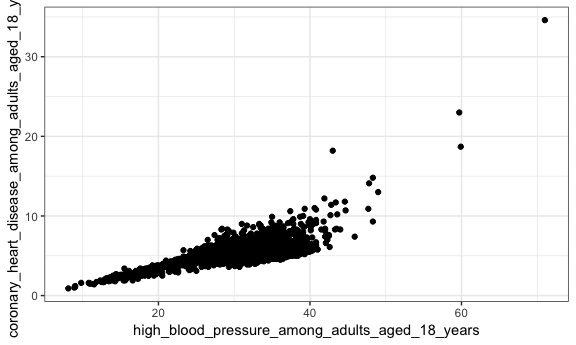

500\_cities\_database
================
Aakriti Gupta
November 17, 2018

Reading in the 500 cities database
----------------------------------

``` r
cvrisk = read_csv("https://data.cdc.gov/api/views/6vp6-wxuq/rows.csv?accessType=DOWNLOAD") %>% 
  janitor::clean_names()
```

Limiting database to New York city
----------------------------------

``` r
nyc_cvrisk = cvrisk %>% 
  filter(state_desc == "New York", city_name == "New York")
```

Making some exploratory plots
-----------------------------

### Plot between high blood pressure and coronary artery disease



### Cleaning database for geocoding

``` r
geo_nyc_cvrisk = nyc_cvrisk %>%
  filter(measure %in% c("High blood pressure among adults aged >=18 Years", "Coronary heart disease among adults aged >=18 Years"), geographic_level == "Census Tract", year == 2015) %>% 
  select(unique_id, measure, data_value, population_count, geo_location) %>% 
  spread(key = measure, value = data_value) %>% 
  janitor::clean_names() %>%
  separate(geo_location, into = c("latitude", "longitude"), sep = ",") %>% 
  mutate(latitude = str_replace(latitude, "\\(", ""),
         longitude = str_replace(longitude, "\\)", ""))
```
