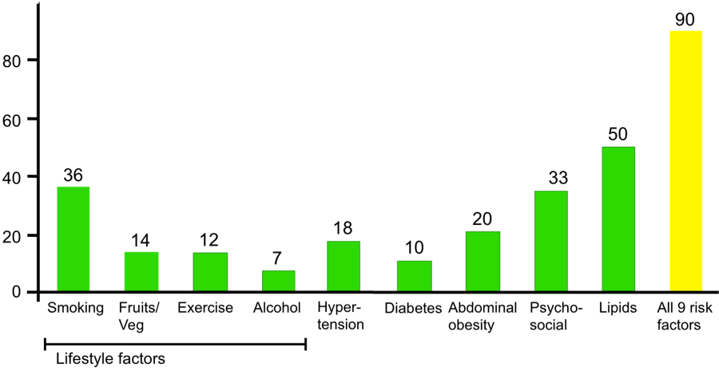

```{r setup, include=FALSE}
knitr::opts_chunk$set(echo = TRUE)
library(tidyverse)
```

#Motivation

###Some facts about heart disease

* Approximately 1.5 million heart attacks and strokes occur every year in the United States.
* More than 800,000 people in the United States die from cardiovascular disease each year—that's 1 in every 3 deaths, and about 160,000 of them occur in people under age 65.
* Heart disease kills roughly the same number people in the United States each year as cancer, pneumonia, and accidents combined.
* Heart disease and stroke cost the nation an estimated $555 billion in health care costs and lost productivity in 2015.

####*Here's more:*

Majority of Americans are already suffering from heart disease:


####*And…*

*About 90% of the risk for the first heart attack is because of conditions or lifestyle factors that are preventable*



There is plenty of room for improvement when it comes to raising awareness for cardiovascular risk, based on a [recent study](https://www.ahajournals.org/doi/pdf/10.1161/JAHA.117.005491) that found one in five adults at risk for heart disease don’t recognize a need to improve their health. We believe that a better understanding of risk factors underlying health perceptions and behaviors is needed to capitalize on cardiovascular preventive efforts.

###Goals of our project

* Understanding risk factors for heart disease and stroke
* Visualizing correlations of these risk factors with heart disease and stroke
* Visualizing the distribution of risk factors and cardiovascular outcomes in New York City
* Predicting risk of heart disease in an individual patient based on presence of risk factors


#Related Work
We were inspired to work on this project given our collective interest in heart disease and role of data science for improved visualization for potential application by healthcare providers, patients and the community. One of our team members, Aakriti, is a cardiology fellow at Columbia, and also co-founder of a preventive cardiology startup called [Heartbeat](https://www.heartbeathealth.com). The mission of this company is to redesign the field of cardiology to be more inclusive and improve quality of life at any age. Their practice focuses on early diagnosis and management that empowers people to feel better, live healthier, understand their heart, and most importantly — have access to a trusted clinical team anywhere. They are a multidisciplinary team of doctors, educators, engineers, and researchers making prevention as simple as getting the heart checked. They are headquartered in Manhattan. 

Drawing inspiration from this work, we created this website with the goal to develop interactive visualization of heart disease prevalence and risk factors that are easy to understand for lay people so that they begin to understand their individualized risk and can begin to take steps toward prevention.


#Initial questions

We sought to examine the risk factors for heart disease and their prevalence in New York City. We were also interested in examining novel ways of visualizing the correlation of indivisual risk factors with heart disease and stroke based on our knowledge gained in the Data Science class. In addition, we also wanted to find ways of predicting and visualizing an individual's risk for heart disease. As such, our questions were as follows:

* What are the risk factors for heart disease and stroke? How can we visualize the correlation of individual risk factors with heart disease and stroke?
* What is the distribution of these risk factors and outcomes in New York city?
* How can we predict and visualize an individual's risk for heart disease?

#Data

In order to address the first two questions, we utilized the [500 Cities: Local Data for Better Health](https://catalog.data.gov/dataset/500-cities-local-data-for-better-health-b32fd) dataset. The 500 Cities project is a collaboration between CDC, the Robert Wood Johnson Foundation, and the CDC Foundation. The purpose of the 500 Cities Project is to provide city- and census tract-level small area estimates for chronic disease risk factors, health outcomes, and clinical preventive service use for the largest 500 cities in the United States. These small area estimates will allow cities and local health departments to better understand the burden and geographic distribution of health-related variables in their jurisdictions, and assist them in planning public health interventions. Since we were interested in visualizing these data only for New York city, we filtered the dataset to include data only from New York city.

In order to predict risk for heart disease for an individual, we utilized the [Framigham Risk Score](https://en.wikipedia.org/wiki/Framingham_Risk_Score). The Framingham Risk Score is a gender-specific algorithm used to estimate the 10-year cardiovascular risk of an individual. The Framingham Risk Score was first developed based on data obtained from the [Framingham Heart Study](https://en.wikipedia.org/wiki/Framingham_Heart_Study), to estimate the 10-year risk of developing coronary heart disease. We utilized the algorithm to develop visualization in ShinyApp as discussed below.


#Exploratory Analysis


#Additional Analysis


#Discussion