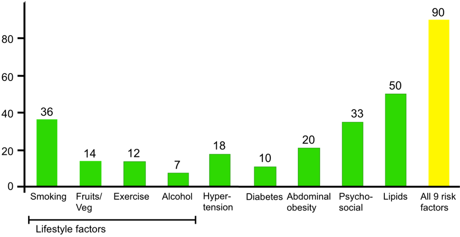
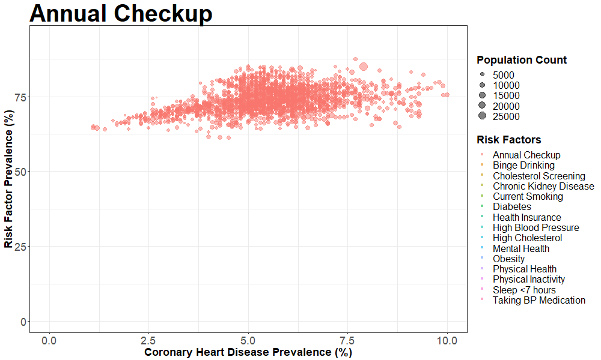
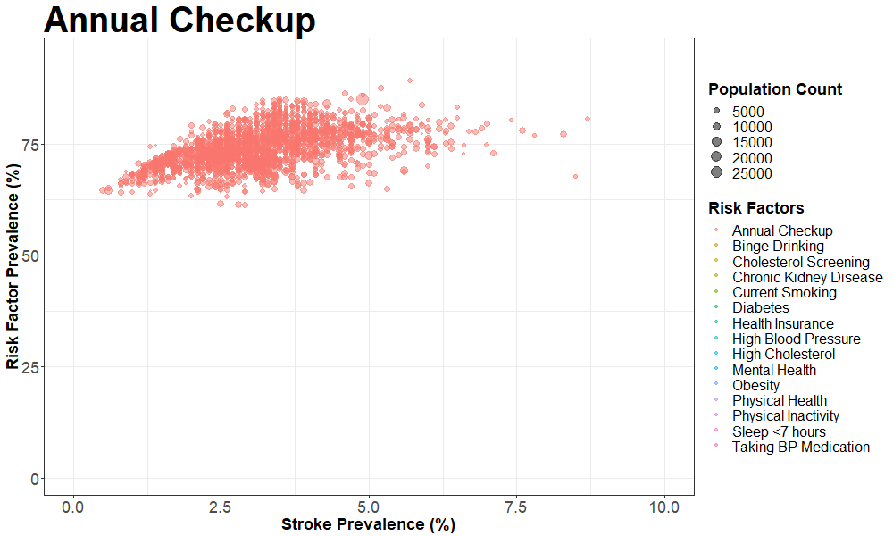
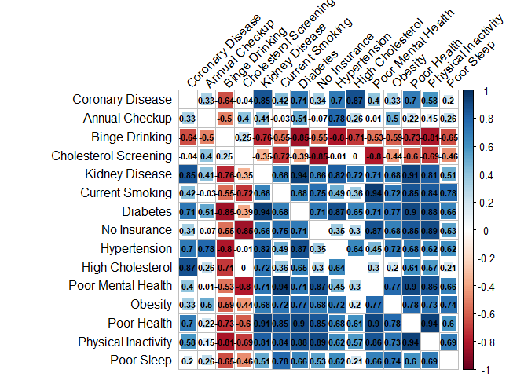
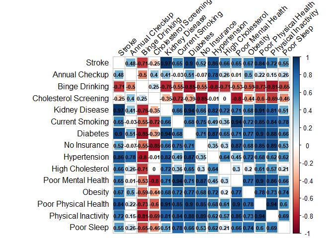

The Heart Project
================
Annie, Margaret, Jiyue & Aakriti
December 6, 2018

``` r
knitr::opts_chunk$set(echo = TRUE)
source("check_packages_report.R")
theme_set(theme_bw())
```

Motivation
==========

### Some facts about heart disease

-   Approximately 1.5 million heart attacks and strokes occur every year in the United States.
-   More than 800,000 people in the United States die from cardiovascular disease each year—that's 1 in every 3 deaths, and about 160,000 of them occur in people under age 65.
-   Heart disease kills roughly the same number people in the United States each year as cancer, pneumonia, and accidents combined.
-   Heart disease and stroke cost the nation an estimated $555 billion in health care costs and lost productivity in 2015.

#### *Here's more:*

Majority of Americans are already suffering from heart disease. The prevalence of heart disease in the US is shown in the map below.


#### *And…*

*About 90% of the risk for the first heart attack is because of conditions or lifestyle factors that are preventable.*



There is plenty of room for improvement when it comes to raising awareness for cardiovascular risk, based on a [recent study](https://www.ahajournals.org/doi/pdf/10.1161/JAHA.117.005491) that found one in five adults at risk for heart disease don’t recognize a need to improve their health. We believe that a better understanding of risk factors underlying health perceptions and behaviors is needed to capitalize on cardiovascular preventive efforts.

### Goals of our project

-   Understanding risk factors for heart disease and stroke
-   Visualizing correlations of these risk factors with heart disease and stroke
-   Visualizing the distribution of risk factors and cardiovascular outcomes in New York City
-   Predicting risk of heart disease in an individual patient based on presence of risk factors

Related Work
============

We were inspired to work on this project given our collective interest in heart disease and role of data science for improved visualization for potential application by healthcare providers, patients and the community. One of our team members, Aakriti, is a cardiology fellow at Columbia, and also co-founder of a preventive cardiology startup called [Heartbeat](https://www.heartbeathealth.com). The mission of this company is to redesign the field of cardiology to be more inclusive and improve quality of life at any age. Their practice focuses on early diagnosis and management that empowers people to feel better, live healthier, understand their heart, and most importantly — have access to a trusted clinical team anywhere. They are a multidisciplinary team of doctors, educators, engineers, and researchers making prevention as simple as getting the heart checked. They are headquartered in Manhattan.

Drawing inspiration from this work, we created this website with the goal to develop interactive visualization of heart disease prevalence and risk factors that are easy to understand for lay people so that they begin to understand their individualized risk and can begin to take steps toward prevention.

Initial questions
=================

We sought to examine the risk factors for heart disease and their prevalence in New York City. We were also interested in examining novel ways of visualizing the correlation of indivisual risk factors with heart disease and stroke based on our knowledge gained in the Data Science class. In addition, we also wanted to find ways of predicting and visualizing an individual's risk for heart disease. As such, our questions were as follows:

-   What are the risk factors for heart disease and stroke? How can we visualize the correlation of individual risk factors with heart disease and stroke?
-   What is the distribution of these risk factors and outcomes in New York city?
-   How can we predict and visualize an individual's risk for heart disease?

Data
====

In order to address the first two questions, we utilized the [500 Cities: Local Data for Better Health](https://catalog.data.gov/dataset/500-cities-local-data-for-better-health-b32fd) dataset. The 500 Cities project is a collaboration between CDC, the Robert Wood Johnson Foundation, and the CDC Foundation. The purpose of the 500 Cities Project is to provide city- and census tract-level small area estimates for chronic disease risk factors, health outcomes, and clinical preventive service use for the largest 500 cities in the United States. These small area estimates will allow cities and local health departments to better understand the burden and geographic distribution of health-related variables in their jurisdictions, and assist them in planning public health interventions. Since we were interested in visualizing these data only for New York city, we filtered the dataset to include data only from New York city.

The data can also be downloaded on [Google Drive](https://drive.google.com/drive/folders/1U_8orguSxdIiNpxj_6sx8rav6ubqmmrq)

Risk factors that we're interested in: (15 total)

-   ACCESS2: Current lack of health insurance among adults aged 18-64 Years
-   BINGE: Binge drinking among adults aged &gt;=18 Year
-   BPHIGH: High blood pressure among adults aged &gt;=18 Year
-   BPMED: Taking medicine for high blood pressure control among adults aged &gt;=18 Years with high blood pressure
-   OBESITY: Obesity among adults aged &gt;=18 Years
-   CHECKUP: Visits to doctor for routine checkup within the past Year among adults aged &gt;=18 Years
-   CHOLSCREEN: Cholesterol screening among adults aged &gt;=18 Years
-   CSMOKING: Current smoking among adults aged &gt;=18 Years
-   DIABETES: Diagnosed diabetes among adults aged &gt;=18 Years
-   HIGHCHOL: High cholesterol among adults aged &gt;=18 Years who have been screened in the past 5 Years
-   KIDNEY: Chronic kidney disease among adults aged &gt;=18 Years
-   LPA: No leisure-time physical activity among adults aged &gt;=18 Years
-   MHLTH: Mental health not good for &gt;=14 days among adults aged &gt;=18 Years
-   PHLTH: Physical health not good for &gt;=14 days among adults aged &gt;=18 Years
-   SLEEP: Sleeping less than 7 hours among adults aged &gt;=18 Years

Outcomes that we're interested in: (2 total)

-   CHD: Coronary heart disease among adults aged &gt;=18 Years
-   STROKE: Stroke among adults aged &gt;=18 Years

In order to predict risk for heart disease for an individual, we utilized the [Framigham Risk Score](https://en.wikipedia.org/wiki/Framingham_Risk_Score). The Framingham Risk Score is a gender-specific algorithm used to estimate the 10-year cardiovascular risk of an individual. The Framingham Risk Score was first developed based on data obtained from the [Framingham Heart Study](https://en.wikipedia.org/wiki/Framingham_Heart_Study), to estimate the 10-year risk of developing coronary heart disease. We utilized the algorithm to develop visualization in ShinyApp as discussed below.

Exploratory Analysis
====================

### Loading and tidying the data

We scraped the data directly from the web as seen in the code below and called it `cvrisk`.

``` r
cvrisk = read_csv("https://data.cdc.gov/api/views/6vp6-wxuq/rows.csv?accessType=DOWNLOAD") %>% 
    janitor::clean_names() 
```

We then restricted our database to census tract -level data in New York City and included only the variables that were useful for further data visualization. We called this database `nyc_cvrisk`. We then exported this to a csv in our repository so that we can read in the limited dataset for future use to improve efficiency.

There were 591 missing values in the dataset, which corresponded to observations that had population counts less than 50. For this reason, we did include these datapoints in our analysis and removed them while tidying.

``` r
nyc_cvrisk = 
  cvrisk %>% 
  filter(state_desc == "New York", city_name == "New York",
         geographic_level == "Census Tract",
         !is.na(data_value),
         measure_id %in% c("ACCESS2", "BINGE", "BPHIGH", "BPMED", "OBESITY", "CHECKUP", 
                         "CHOLSCREEN", "CSMOKING", "DIABETES", "HIGHCHOL", "KIDNEY", 
                         "LPA", "MHLTH", "PHLTH", "SLEEP", "CHD", "STROKE")) %>%
  droplevels() %>% 
  select(unique_id, population_count, measure_id, data_value, short_question_text)
```

The following is a distribution of the prevalences of all of the relevant variables. As you can see the risk factors with highest prevalence involve screening and medication (BPMED, CHECKUP and CHOLSCREEN). The risk factors with the lowest prevlances are diseases (CHD, KIDNEY and STROKE). There is a general trend of higher variance among risk factors with higher prevalences.

``` r
nyc_cvrisk %>%
  mutate(measure_id = forcats::fct_reorder(measure_id, data_value)) %>% 
  ggplot(aes(x = measure_id, y = data_value, color = measure_id)) + 
  geom_boxplot() +
  theme(axis.text.x = element_text(angle = 60, hjust = 1),
        legend.position = "none") + 
   labs(
      title = "Risk Factor Prevalence in NYC 2015-2016",
      x = "Risk Factor",
      y = "Prevalence (%)",
      caption = "Data from the CDC"
    ) + 
    viridis::scale_color_viridis(discrete = TRUE)
```


### Making the animated scatterplot for coronary artery disease

We first created another dataset that can be used for the animated scatterplot such that the outcome measure for coronary artery disease appears as a separate variable in the dataset. We created another similar dataset for stroke.

``` r
nyc_cvrisk_limited = nyc_cvrisk %>% 
  filter(short_question_text %in% c("Annual Checkup", "Binge Drinking", "Cholesterol Screening",
                                    "Chronic Kidney Disease", "Current Smoking", "Diabetes", 
                                    "Health Insurance", "High Blood Pressure", "High Cholesterol",
                                    "Mental Health", "Obesity", "Physical Health", 
                                    "Physical Inactivity", "Sleep <7 hours", 
                                    "Taking BP Medication")) %>% 
  droplevels() %>% 
  mutate(risk_factor = short_question_text) %>% 
  select(-short_question_text, -measure_id)

nyc_cad = nyc_cvrisk %>% 
  filter(short_question_text == "Coronary Heart Disease") %>%
  droplevels() %>% 
  select(-measure_id, -short_question_text, -population_count)

nyc_stroke = nyc_cvrisk %>% 
  filter(short_question_text == "Stroke") %>%
  droplevels() %>% 
  select(-measure_id, -short_question_text, -population_count)

nyc_cvrisk_joined = left_join(nyc_cvrisk_limited, nyc_cad, by = "unique_id")
nyc_cvrisk_joined_stroke = left_join(nyc_cvrisk_limited, nyc_stroke, by = "unique_id")
```

We then created an animated scatterplot using `gganimate` with Coronary Heart Disease prevalence on the X-axis and different risk factors on the Y-axis

``` r
## using transition_length and state_length
library(ggplot2)
library(gganimate)

p = nyc_cvrisk_joined %>%  
  ggplot(aes(x = data_value.y, y = data_value.x, frame = risk_factor)) +
  geom_point(aes(size = population_count, colour = risk_factor ),
             alpha = 0.5) + 
  xlim(0, 10) +
  
  labs(title = "{closest_state}",
       x = 'Coronary Heart Disease Prevalence (%)', 
       y = 'Risk Factor Prevalence (%)',
       colour = 'Risk Factors',
       size = 'Population Count') +
  
  theme(plot.title = element_text(size = 40, face = "bold"),
        axis.text=element_text(size=18),
        axis.title=element_text(size=18,face="bold")) + 
  theme(legend.text=element_text(size=16), legend.title=element_text(size=18,face="bold") ) +
  
  # gganimate parts
  transition_states(risk_factor, transition_length = 1, state_length = 3, wrap = TRUE) +
  enter_fade() +
  exit_fade()

animate(p, fps = 2, height = 600, width = 1000)
```



### Making the animated scatterplot for stroke

We created a similar animation for stroke, the code for which is shown here.

``` r
pp = nyc_cvrisk_joined_stroke %>%  
  ggplot(aes(x = data_value.y, y = data_value.x, frame = risk_factor)) +
  geom_point(aes(size = population_count, colour = risk_factor ),
             alpha = 0.5) + 
  xlim(0, 10) +
  
  labs(title = "{closest_state}",
       x = 'Stroke Prevalence (%)', 
       y = 'Risk Factor Prevalence (%)',
       colour = 'Risk Factors',
       size = 'Population Count') +
  
  theme(plot.title = element_text(size = 40, face = "bold"),
        axis.text=element_text(size=18),
        axis.title=element_text(size=18,face="bold")) + 
  theme(legend.text=element_text(size=16), legend.title=element_text(size=18,face="bold") ) +
  
  # gganimate parts
  transition_states(risk_factor, transition_length = 1, state_length = 3, wrap = TRUE) +
  enter_fade() +
  exit_fade()

animate(pp, fps = 2, height = 600, width = 1000)
```



### Making the correlation plot for coronary artery disease

To make the correlation plot, we first transformed our dataset in the wide format and called it `nyc_cvrisk_wide`.

``` r
nyc_cvrisk_wide = 
  nyc_cvrisk %>% 
  select(-measure_id)%>%
  spread(key = short_question_text, value = data_value) %>% 
  janitor::clean_names()
```

The correlation plot for coronary heart disease and risk factors of interest is as follows:

``` r
nyc_cvrisk_wide %>% 
  select(annual_checkup:sleep_7_hours) %>% 
  select("coronary_heart_disease", everything())%>%
  rename("Coronary Disease" = coronary_heart_disease,
         "Annual Checkup" = annual_checkup,
         "Binge Drinking" = binge_drinking,
         "Kidney Disease" = chronic_kidney_disease,
         "High Cholesterol" = high_cholesterol,
         "Hypertension" = high_blood_pressure,
         "Cholesterol Screening" = cholesterol_screening,
         "Current Smoking" = current_smoking,
         "Diabetes" = diabetes,
         "No Insurance" = health_insurance,
         "Poor Mental Health" = mental_health,
         "Obesity" = obesity,
         "Poor Health" = physical_health,
         "Physical Inactivity" = physical_inactivity,
         "Poor Sleep" = sleep_7_hours)%>%
  cor() %>% 
  corrplot(method = "square", addCoef.col = "black", tl.col="black", tl.srt=45, insig = "blank", 
         # hide correlation coefficient on the principal diagonal
         diag=FALSE, number.cex = .7)
```



### Making the correlation plot for stroke

The correlation plot for stroke and risk factors of interest is as follows:

``` r
nyc_cvrisk_wide %>% 
  select(annual_checkup:stroke)%>%
  select(stroke, everything()) %>% 
  select(-c(coronary_heart_disease))%>%
  rename("Stroke" = stroke,
         "Annual Checkup" = annual_checkup,
         "Binge Drinking" = binge_drinking,
         "Kidney Disease" = chronic_kidney_disease,
         "High Cholesterol" = high_cholesterol,
         "Hypertension" = high_blood_pressure,
         "Cholesterol Screening" = cholesterol_screening,
         "Current Smoking" = current_smoking,
         "Diabetes" = diabetes,
         "No Insurance" = health_insurance,
         "Poor Mental Health" = mental_health,
         "Obesity" = obesity,
         "Poor Physical Health" = physical_health,
         "Physical Inactivity" = physical_inactivity,
         "Poor Sleep" = sleep_7_hours)%>%
  cor() %>% 
  corrplot(method = "square", addCoef.col = "black", tl.col="black", tl.srt=45, insig = "blank", 
         # hide correlation coefficient on the principal diagonal
         diag=FALSE, number.cex = .7)
```



Findings
========

We made several salient observations about correlation of risk factors with *Coronary Artery Disease* and *Stroke*.

All of the risk factors (with the exception of binge drinking and cholesterol screening) have a positive association with both coronary heart disease and stroke. The top three risk factors for both outcomes are chronic kidney disease, diabetes and poor physical Health. In addition, many of the risk factors are associated with each other; namely, physical inactivity is heavily correlated with many of the other variables. The risk factors tend to be similarly associated with both coronary heart disease and stroke, with stronger associations with stroke.

### Factors correlated with coronary artery disease

We observed that the following factors were strongly positively correlated with coronary artery disease:

-   High Blood Pressure - r = 0.7
-   High Cholesterol - r = 0.9
-   Chronic Kidney Disease - r = 0.85
-   Diabetes - r = 0.71
-   Poor Physical Health - r = 0.7
-   Physical Inactivity - r = 0.6
-   Poor Mental Health - r = 0.4
-   Current Smoking - r = 0.4

We observed that the following factors were strongly negatively correlated with coronary artery disease:

-   Binge Alcohol Drinking - r = -0.6

### Factors correlated with stroke

We observed that the following factors were strongly positively correlated with coronary artery disease:

-   High Blood Pressure - r = 0.9
-   High Cholesterol - r = 0.7
-   Chronic Kidney Disease - r = 0.97
-   Diabetes - r = 0.9
-   Poor Physical Health - r = 0.8
-   Physical Inactivity - r = 0.7
-   Poor Mental Health - r = 0.7
-   Current Smoking - r = 0.7
-   Obesity - r = 0.7
-   Poor Sleep - r = 0.6
-   Lack of Health Insurance - r = 0.5

We observed that the following factors were strongly negatively correlated with coronary artery disease:

-   Binge Alcohol Drinking - r = -0.7
-   Cholesterol Screening - r = -0.25

Additional Analysis
===================

### Geocoding

We used the `shinyApp` and `leaflet` package to perform visualization of geographic distribution of several risk factors and outcomes in New York City. We observed that most of the risk factors were observed with higher frequency in the Harlem and Bronx area. Unhealthy behaviors like binge alcohol drinking, however, were more prevalent in downtown Manhattan.

### Risk Prediction

We also used `shinyApp` and `plotly` package to build a program to calculate individual risk of heart disease using the Framingham Risk Score. This app allows for input of risk factor variables of an indivdual and predicts the 10-year cardiovascular risk using the Framingham risk score algorithm.

Discussion
==========

In the process of building this project, we gained several insights about risk factors for heart disease.

-   In particular, the strength of correlation of lifestyle risk factors like physical inactivity and smoking with coronary artery disease and stroke indicate the potential for making an impact by targeting these interventions. Moreover, modifiable risk factors like high blood pressure and high cholesterol are strongly associated with heart disease and stroke and cholesterol screening is inversely associated, suggesting the need to spread awareness about these risk factors so that they can be diagnosed and treated early. Interestingly, alcohol intake was negatively correlated with both coronary disease and stroke. This has been observed in several meta-analyses as well. This is however, likely only an association, and not evidence of causation, as discussed in [this article](http://www.onlinejacc.org/content/accj/69/1/25.full.pdf).

-   Visualization of geographic variation of these risk factors in outcomes in New York City provide insights into target neighborhoods for implementation of cardiovascular risk reduction policies.

-   Visualization of individual risk for heart disease using patient-level inputs, and the ability to understand how modification of one input can impact the risk can be very powerful for people working toward decreasing their risk.
